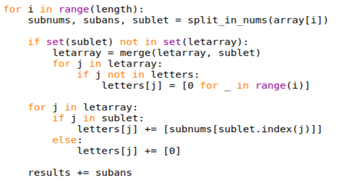

# Отчет по лабораторной работе 

## Установка Python
Для установки Python зайдем в терминал и выполним следующие команды:
```
sudo apt-get update
apt search idle-python
sudo apt-get install idle-python3.10
```
Python версии 3.10 установлен. Найдём в списке приложений появившийся IDLE, откроем его и создадим новый файл с расширением .py, в котором будем писать код программы. 
## Работа с Tesseract и считывание текста с картинки

Установим библиотеку Tesseract:
```
sudo apt install tesseract-ocr
```
Импортируем библиотеки Tesseract и PIL. Загружаем изображение и распознаем текст на нём:
 
Распознанный текст сохраним в массив, где каждый элемент массива будет содержать одно уравнение системы:
 
## Работа с представлением уравнений в виде матриц и решение системы уравнений

Для старта импортируем установленные ранее scipy и numpy. Для решения задачи необходимо получить две матрицы: одна для хранения коэффициентов перед неизвестными, вторая для хранения результатов уравнений.
Для матрицы коэффициентов понадобится знать коэффициенты для каждой переменной, включая коэффициенты равные нулю. Чтобы составить эту матрицу понадобятся массив для хранения букв и словарь для хранения коэффициентов по переменным.


Каждую полученную строку необходимо разбить по знакам "+", "-" и "=", для этого создадим функцию, которая будет находить выбранные символы и записывать часть строки между знаками операций или в массив с коэффициентами и в массив с переменными, или в массив с результатами. Для упрощения считывания добавим переменную для запоминания индекса предыдущего знака. 
На каждый знак мы должны выполнить определённые действия:
- Для "+" считать фрагмент строки между знаками, записать последний символ в массив с переменными и коэффициент в соответствующий массив. Если коэффициента нет, то запишем 1 в массив с коэффициентами.
- Для "-" считываем фрагмент от "-" до следующего знака и проделываем операции, как для "+"
- Для "=" для фрагмента от предыдущего знака выполняем операции как для знака "+" и считываем часть справа от равно, записываем её в массив с результатами.
Созданная функция возвращает массивы с коэффициентами строки, с результатом строки и с переменными.


Теперь запишем функцию для соединения массивов с переменными. Каждую букву второго массива, которой нет в первом массиве, запишем в первый массив. Изменённый первый массив вернём.


Теперь проверим каждую строку через цикл, в котором сначала запускаем созданную функцию. Следующим шагом сверяеем длину массива с буквами с массивом букв текущей строки, чтобы записать нулевые коэффициенты для переменных, появившихся в первый раз. Теперь пройдём по массиву со всеми переменными, если переменных не было в текущей строке, то записываем коэффициент 0, иначе, тот, который получили в результате работы функции.



Последним шагом по составлению необходимых массивов составим матрицу с коэффициентами. Для выполнения этого шага запустим цикл на количество полученных уравнений, для каждого уравнения пройдём по всем переменным и запишем соответствующий коэффициент.
Далее для корректной работы scipy создадим numpy массив по матрице с коэффициентами, и numpy массив для результатов и сделаем из строки столбец.
Используя scipy находим значения для переменных и выводим их на экран в порядке, в котором переменные записаны в соответствующем массиве.


## Результаты работы программы
Подадим на вход в программу следующую картинку:


Программа, разработанная в ходе лабораторной работы, выдаёт следующий результат:

 
Решение СЛАЛУ верно, что подтверждает правильность работы программы. Следовательно, лабораторная работа выполнена успешно. 
